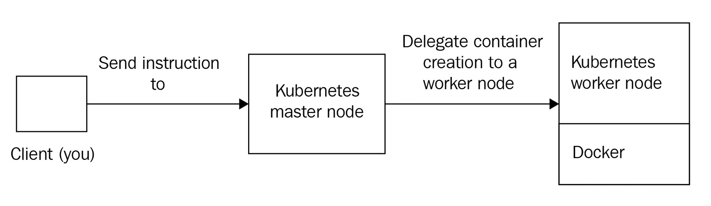
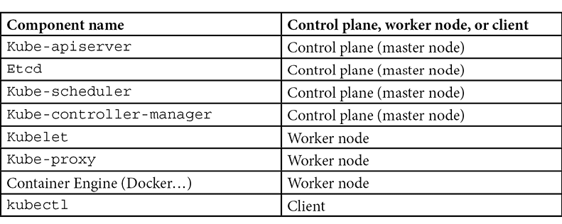
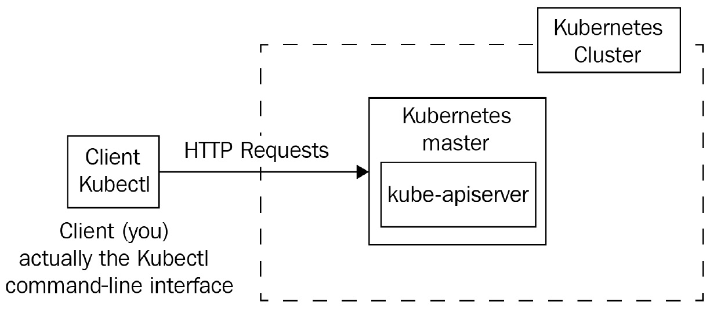

#  Kubernetes Architecture

## Understanding the difference between the master and worker nodes
To run Kubernetes, you will require Linux/windows machines, which are called nodes in Kubernetes. There are two types of nodes in Kubernetes:

* Master nodes -> responsible for maintaining the state of the Kubernetes cluster
* Worker nodes -> responsible for executing Docker containers

you can mix Linux and Windows machines on your cluster and it will work the same, but you cannot launch a Windows container on a Linux worker node and vice versa.

Kubernetes is not a single monolithic app released as a single build that you would install on a dedicated machine.

Depending on its role, a component will have to be deployed on a master node or a worker node. the components of Kubernetes can be grouped into two families:

* `Components belonging to the Control Plane`:
These components are responsible for maintaining the state of the cluster. They should be installed on a master node. These are the components that will keep the list of containers executed by your Kubernetes cluster or the number of machines that are part of the cluster. As an administrator, when you interact with Kubernetes, you actually interact with the control plane components.

* `Components belonging to the Worker Nodes`:
These components are responsible for interacting with the Docker daemon in order to launch containers according to the instructions they receive from the control plane components. Worker node components must be installed on a Linux machine running a Docker daemon. You are not supposed to interact with these components directly. It's possible to have hundreds or thousands of worker nodes in a Kubernetes cluster.

Kubernetes components

The majority of these components have a name starting with `Kube`: these are the components that are part of the Kubernetes project. Additionally, you might have noticed that there are two components with a name that does not start with Kube. The other two (Etcd and Container Engine) components are two external dependencies that are not strictly part of the Kubernetes project, but which Kubernetes needs in order to work:

* `Etcd` is a third-party database used by the Kubernetes project
* The `container runtime` is also a third-party engine.

## The kube-apiserver component
* When you want to give an instruction to Kubernetes, you will always have to send an HTTP request to `kube-apiserver`.

* The `kube-apiserver` component is built according to the REST standard.

*`kube-apiserver` is the single entry point for all operations issued to the orchestrator.

* By default, HTTP servers listen to port 80, whereas HTTPS services listen to port 443. This is not the case with kube-apiserver. By default, the port it listens to is port 6443.

*  It is also stateless; that is, it keeps the state of the resources by relying on a database engine called Etcd. This means you can horizontally scale the kube-apiserver component by deploying it onto multiple machines and load balance request issues to it using a layer 7 load balancer without losing data.

* Other Kubernetes components constantly send HTTP requests to kube-apiserver in order to understand the state of the cluster or to update.

## Exploring the kubectl command-line tool and YAML syntax

We will always interact with Kubernetes through kubectl. Once the kube-apiserver component receives a valid HTTP request coming from you, it will read or update the state of the cluster in Etcd based on the request we submitted. 